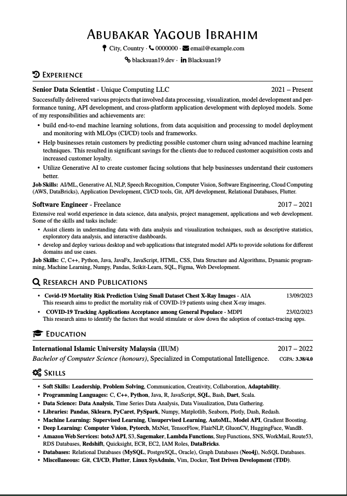

# LaTeX Resume Template

Simple ATS friendly Latex resume template using font awesome icons.

## Features

- Clean, professional design
- Easy to customize
- Includes examples for common resume sections
- Built-in font files
- custom commands for easy formatting (e.g. `\role` and `\datedsubsection`)

<details>
<summary>Resume Format Preview</summary>

</details>

## Getting Started

To get started, simply clone this repository and open the `resume.tex` file in
your favorite LaTeX editor (vs code recommended). From there, you can customize
the template to fit your needs.

## Directory Structure

The directory structure is as follows:

```bash
fonts/          # Contains fonts used in the template
meta/           # Contains main resume class file and other meta files
sections/       # Contains sections of the resume (e.g. education, experience)
resume.tex      # Main resume file
```

## Contributing

If you find a bug or have a suggestion for improvement, please open an issue or
submit a pull request. We welcome contributions from the community!

## License

This project is licensed under the MIT License - see the [LICENSE](LICENSE) file
for details.
